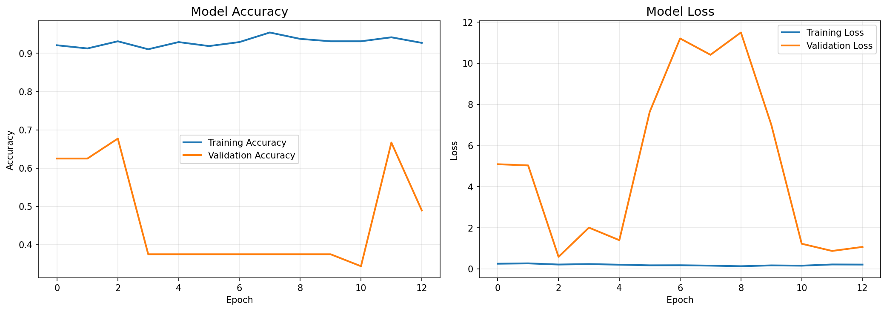
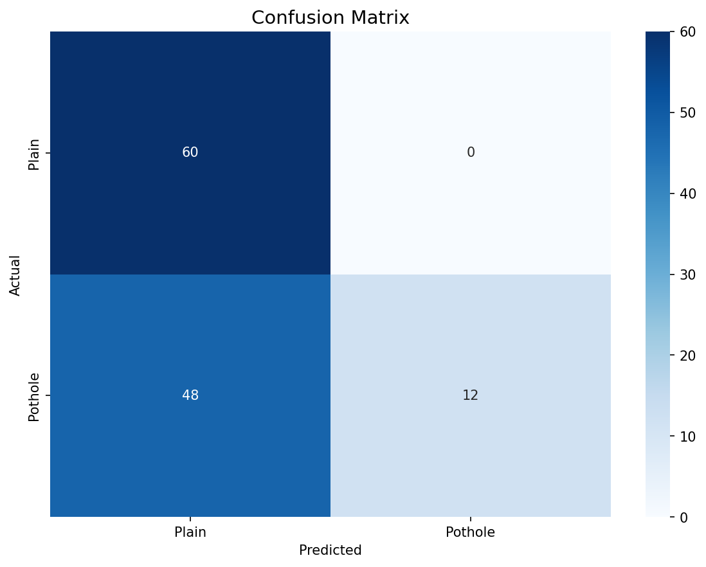
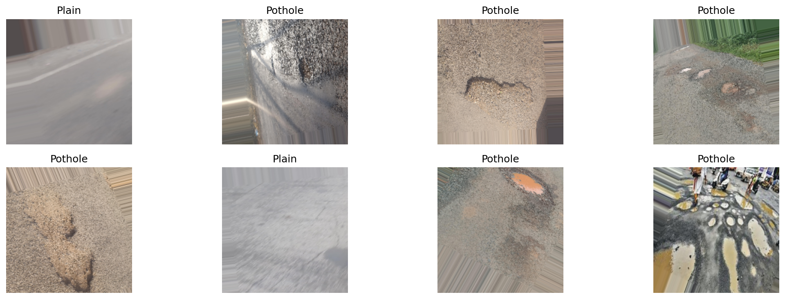

# Pothole vs. Intact Asphalt Road Detection

Binary image classification of road surfaces as **Pothole** or **Plain (Intact Asphalt)**, using a custom CNN built with TensorFlow/Keras and deployed as a Streamlit web application.

**GET 324 — Laboratory Exercise 10 (Mini-Project) | Group EE25**
Department of Electrical and Electronics Engineering, University of Uyo

**Live application:** [pothole-vs-intact-asphalt-road.streamlit.app](https://pothole-vs-intact-asphalt-road.streamlit.app/)

---

## Contents

- [The Problem](#the-problem)
- [What the Application Does](#what-the-application-does)
- [Dataset](#dataset)
- [Model](#model)
- [Training](#training)
- [Results](#results)
- [How to Use](#how-to-use)
- [Limitations](#limitations)
- [Possible Improvements](#possible-improvements)
- [Contributors](#contributors)
- [Citations](#citations)

## The Problem

Potholes are a leading cause of road accidents, vehicle damage, and increased maintenance costs. In Nigeria and many developing countries, road surface deterioration is widespread, yet detection still relies on manual inspection — slow, inconsistent, and reactive rather than preventive.

An AI model that classifies road surface photographs can automate initial screening, enabling road maintenance authorities to prioritise repairs before damage escalates.

## What the Application Does

Upload a photograph of a road surface. The application returns:

- A label: **Pothole** or **Plain** (intact asphalt)
- A confidence score for the prediction
- The raw sigmoid output and decision threshold

The trained model runs server-side. No image is stored after prediction.

## Dataset

**Source:** Road Anomaly Detection System Dataset from Mendeley Data

The dataset contains 600 road surface images, evenly split across two classes:

| Class | Count |
| :--- | :--- |
| Pothole | 300 |
| Plain (Intact Asphalt) | 300 |
| **Total** | **600** |

**Link:** [DOI: 10.17632/fbhdy3bxgv.2](https://data.mendeley.com/datasets/fbhdy3bxgv/2)
**License:** Creative Commons Attribution 4.0 International

**Data Splits:** An 80/20 train-validation split was applied using `ImageDataGenerator` with a fixed seed (42) for reproducibility.

| Split | Images |
| :--- | :--- |
| Training | 480 |
| Validation | 120 |

## Model

A custom Convolutional Neural Network (CNN) built from scratch using TensorFlow/Keras.

| Component | Detail |
| :--- | :--- |
| Conv Block 1 | Conv2D(32, 3x3) + BatchNorm + MaxPool(2x2) + Dropout(0.25) |
| Conv Block 2 | Conv2D(64, 3x3) + BatchNorm + MaxPool(2x2) + Dropout(0.25) |
| Conv Block 3 | Conv2D(128, 3x3) + BatchNorm + MaxPool(2x2) + Dropout(0.25) |
| Dense Layer | 256 units (ReLU) + BatchNorm + Dropout(0.5) |
| Output | 1 unit, sigmoid activation |
| Input size | 224 x 224 x 3 |
| Loss | Binary cross-entropy |
| Optimizer | Adam |
| Total parameters | 25,785,793 |

**Data augmentation** was applied during training: rotation (30 degrees), width/height shift (0.2), shear (0.2), zoom (0.2), and horizontal flip.

## Training

Training was conducted on Kaggle using dual Tesla T4 GPUs with TensorFlow 2.20.

- **Epochs:** 15 (early stopped at epoch 13, best weights restored from epoch 3)
- **Callbacks:** ModelCheckpoint (save best), EarlyStopping (patience=10), ReduceLROnPlateau (patience=5, factor=0.5)
- **Best validation loss:** 0.5857 (epoch 3)

Training curves:

The notebook used for training is available at [`ee25-pothole-vs-intact-asphalt-road.ipynb`](ee25-pothole-vs-intact-asphalt-road.ipynb).

## Results

Evaluated on the validation set (120 images).

| Metric | Value |
| :--- | :--- |
| Validation Accuracy | 60.00% |
| Validation Loss | 0.6632 |
| Training Accuracy | ~93% |
| Decision Threshold | 0.5 |

**Classification Report:**

| Class | Precision | Recall | F1-Score | Support |
| :--- | :--- | :--- | :--- | :--- |
| Plain | 0.56 | 1.00 | 0.71 | 60 |
| Pothole | 1.00 | 0.20 | 0.33 | 60 |

**Confusion Matrix:**

The gap between training accuracy (~93%) and validation accuracy (60%) indicates overfitting, primarily due to the small dataset size (600 images total).

## How to Use

1. Open the app: [pothole-vs-intact-asphalt-road.streamlit.app](https://pothole-vs-intact-asphalt-road.streamlit.app/)
2. Upload a JPG or PNG image of a road surface
3. The model classifies it and displays the result with a confidence score

**Sample images:**

## Limitations

- **Small dataset.** Only 600 images total. The model overfits — high training accuracy but modest validation performance. More data would improve generalisation.
- **Whole-image classification only.** The model classifies the entire image. It does not localise or measure pothole size, depth, or severity.
- **Fixed resolution.** Input is resized to 224 x 224 px. Fine details in high-resolution photographs may be lost during downscaling.
- **Domain specificity.** The dataset may not fully represent all road surface types, lighting conditions, or geographic regions.
- **Screening tool, not engineering assessment.** Output is a classification signal, not a structural evaluation.

## Possible Improvements

- **Transfer learning** (MobileNetV2, ResNet50) with pre-trained ImageNet weights to improve generalisation on a small dataset
- **Larger dataset** through additional data collection or more aggressive augmentation
- **Object detection or segmentation** (YOLO, U-Net) to localise and measure potholes
- **Grad-CAM overlays** in the app so users can see what the model focuses on
- **Test-time augmentation** to stabilise borderline predictions

## Contributors

| Reg Number | Name | GitHub |
| :--- | :--- | :--- |
| 22/EG/EE/1996 | Ngadiuba, Sampson Paul (Lead) | [Sampsonp23](https://github.com/Sampsonp23) |
| 22/EG/EE/2114 | James, Solomon Daniel | [solomondaniel2114](https://github.com/solomondaniel2114) |
| 23/EG/EE/091 | George, Napoleon Okon | [Napoleongeorge](https://github.com/Napoleongeorge) |
| 22/EG/EE/2029 | Ekong, Daniel David | [Shady-15-money](https://github.com/Shady-15-money) |
| 22/EG/EE/2088 | Friday, Ekemini Nkerenti | [kemzyfresh](https://github.com/kemzyfresh) |
| 22/EG/EE/2031 | Udo, Benjamin Success | [rapido177](https://github.com/rapido177) |
| 22/EG/EE/1998 | Wariebi, Marcus Wariebi | [Hunterxx](https://github.com/Hunterxx) |
| 22/EG/EE/2080 | Etuk, Samuel Friday | [Samuel-etuk](https://github.com/Samuel-etuk) |
| 23/EG/EE/095 | Akpanam, Destiny Ezekiel | [akpanamdestiny2005](https://github.com/akpanamdestiny2005) |
| 23/EG/EE/094 | Destiny, Peter Peter | [destinypeter76755-eng](https://github.com/destinypeter76755-eng) |
| 22/EG/EE/2099 | Edunoh, John Tiuno | [Samandalichi8-oss](https://github.com/Samandalichi8-oss) |

## Citations

Rathawa, Manavaditya; Kadam, Rutuja; Roshan, Jawad (2025). "Road Anomaly Detection System Dataset", Mendeley Data, V2, doi: 10.17632/fbhdy3bxgv.2. [https://data.mendeley.com/datasets/fbhdy3bxgv/2](https://data.mendeley.com/datasets/fbhdy3bxgv/2)

## License

This project is for educational purposes as part of the GET324 course at the University of Uyo.
